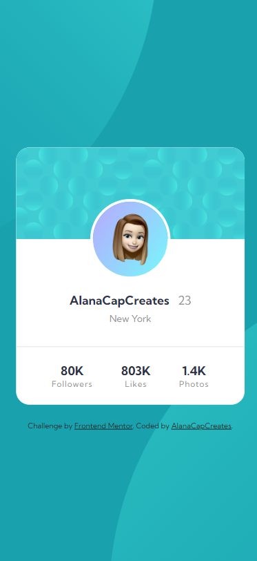
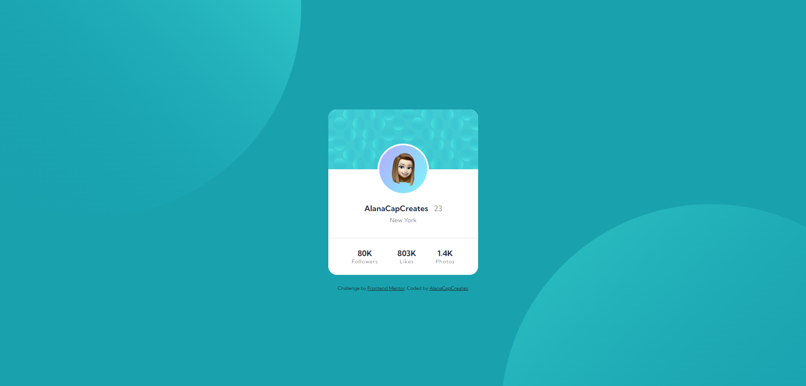

# Frontend Mentor - Profile card component solution

This is a solution to the [Profile card component challenge on Frontend Mentor](https://www.frontendmentor.io/challenges/profile-card-component-cfArpWshJ). Frontend Mentor challenges help you improve your coding skills by building realistic projects. 

## Table of contents

- [Overview](#overview)
  - [The challenge](#the-challenge)
  - [Screenshot](#screenshot)
  - [Links](#links)
- [My process](#my-process)
  - [Built with](#built-with)
- [Author](#author)

## Overview

### The challenge

- Build out the project to the designs provided

### Screenshot
1. Mobile Version

2. Desktop Version

### Links

- Solution URL: [Add solution URL here](https://your-solution-url.com)
- Live Site URL: [acc-fm-profile-card-component.netlify.app](acc-fm-profile-card-component.netlify.app)

## My process

### Built with

- Semantic HTML5 markup
- CSS custom properties
- Flexbox
- Mobile-first workflow

## Author

- Website - [Alana Caporale](https://alanacapcreates.com)
- Frontend Mentor - [@AlanaCapCreates](https://www.frontendmentor.io/profile/alanacapcreates)
- Twitter - [@AlanaCapCreates](https://www.twitter.com/alanacapcreates)
- Instagram - [@AlanaCap.Creates](https://www.instagram.com/alanacap.creates/?hl=en)

